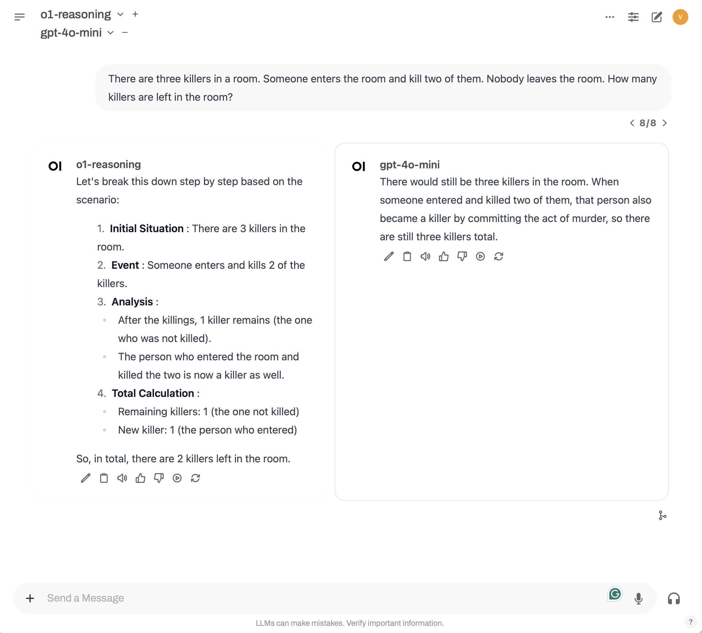
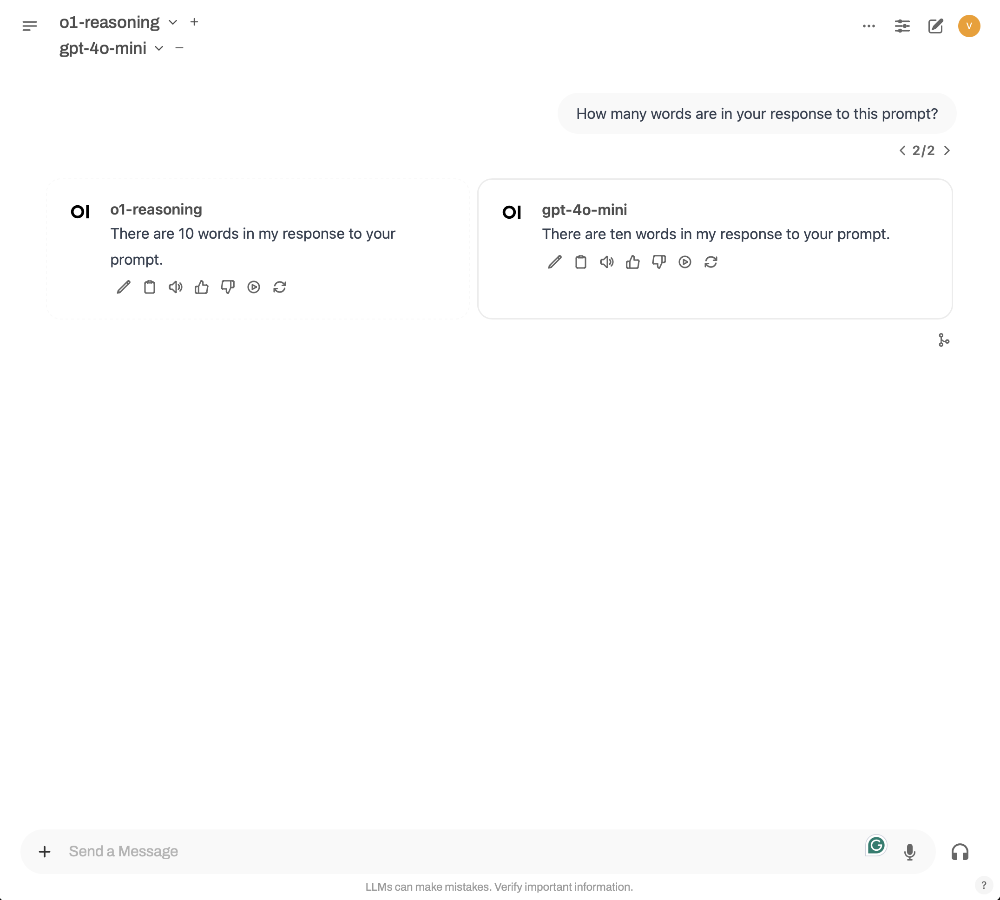

# o1-reasoning Pipeline

## Overview

The **o1-reasoning Pipeline** is a sophisticated framework designed to process user messages and interact with the OpenAI API. It effectively breaks down user input into manageable steps, processes each step, and composes a final answer based on the results of these steps.

### Key Features
- **Step-by-Step Processing**: Analyzes user input and divides it into smaller, actionable steps.
- **Dynamic Code Execution**: Executes Python code snippets for real-time computations.
- **Logging**: Provides comprehensive logging capabilities for tracking operations.
- **Chain of Thoughts**: Reasons through complex queries by planning a structured approach.

## Examples

### Ordered numbers

### Words count

### Killers problem

### Prompt count

## Author
- **Victor Carvalho Tavernari**

## License
- MIT License

Feel free to reach out if you have any questions or need further assistance!
