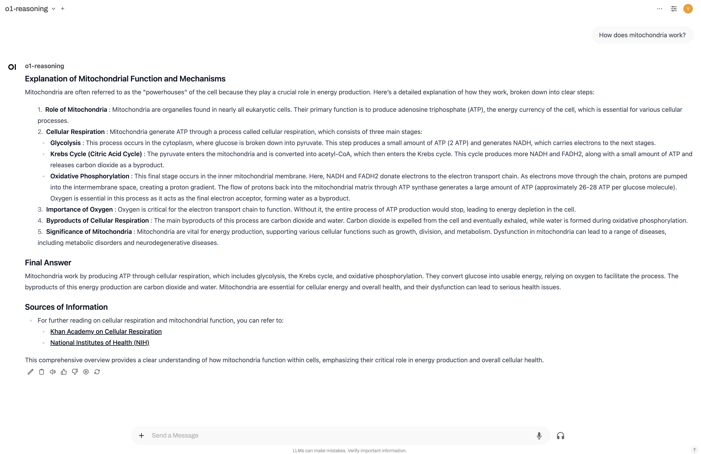
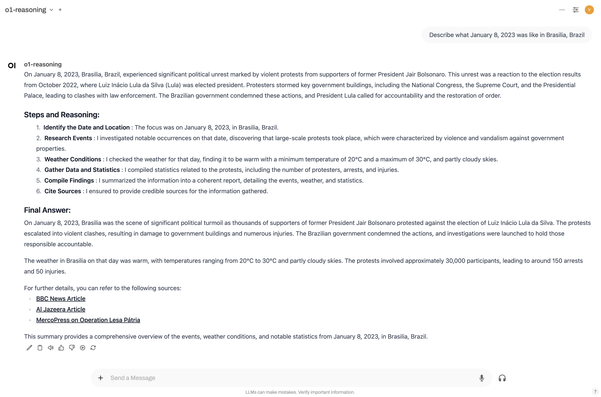
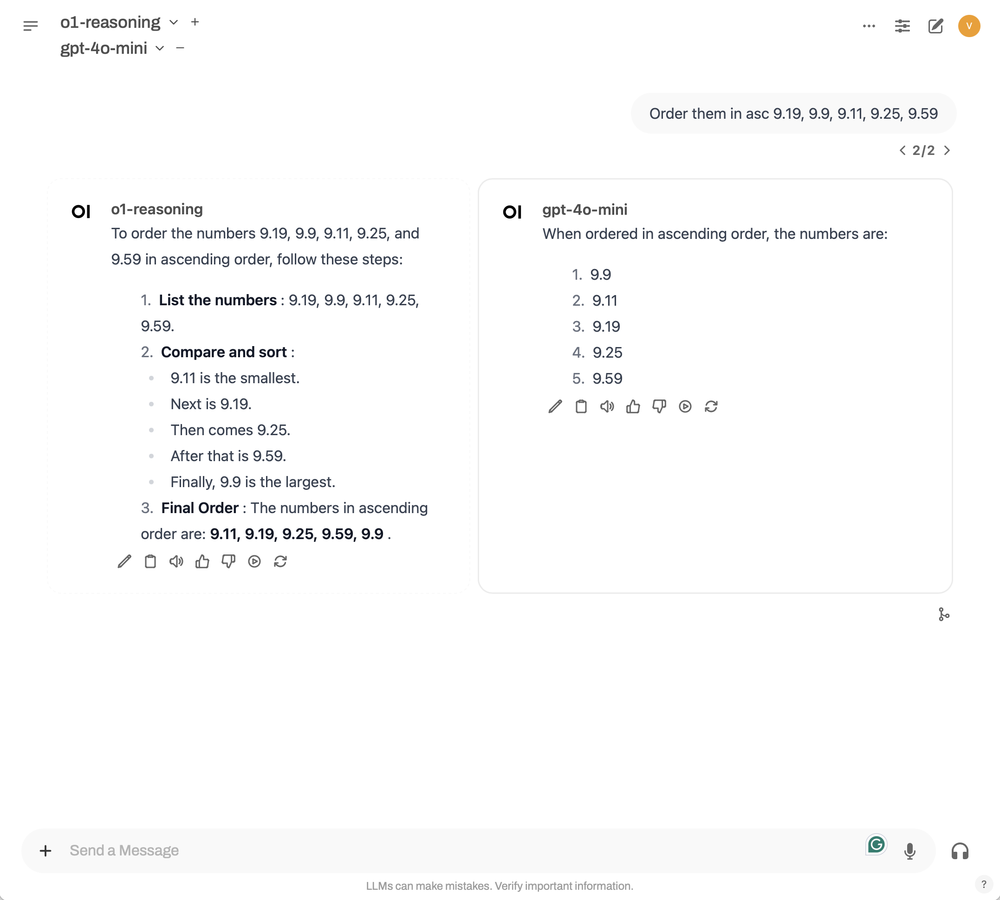
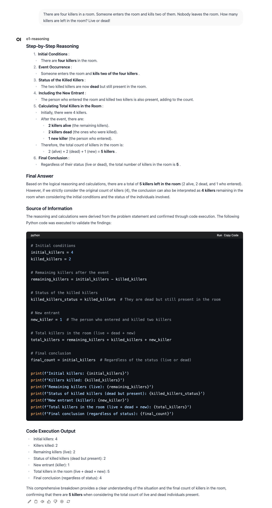

# o1-reasoning Pipeline

## Overview

The **o1-reasoning Pipeline** is a sophisticated framework designed to process user messages and interact seamlessly with the OpenAI API. It effectively decomposes user input into manageable steps, processes each step individually, and compiles a comprehensive final answer based on the results of these steps.

## Key Features

- **Step-by-Step Processing**: Analyzes and divides user input into smaller, actionable steps to ensure thorough understanding and processing.
- **Dynamic Code Execution**: Executes Python code snippets in real-time for computations, validations, and enhanced functionality.
- **Comprehensive Logging**: Offers detailed logging capabilities with color-coded log levels for easy tracking and debugging.
- **Chain of Thoughts**: Implements a structured reasoning approach to handle complex queries by planning and executing a sequence of thought steps.
- **Flexible Tool Integration**: Integrates various tools such as web search, news retrieval, maps search, and website content extraction to enrich responses.
- **User Input Handling**: Supports multiple types of user inputs including logical resolution, code generation, article creation, research, and generic queries.

### Example Workflows

#### Logical Resolution

Processes user queries requiring logical reasoning and step-by-step problem-solving.

#### Code Execution

Executes Python code snippets to validate solutions or perform computations in real-time.

#### Article Generation

Generates comprehensive articles based on user-specified topics with structured sections and detailed content.

#### Research

Conducts thorough research on specified topics, summarizing findings with credible sources and data.

#### Generic Queries

Handles general user questions, providing clear and accurate responses tailored to the user's language and requirements.

## Architecture

### Models

- **UserInputDetails**: Captures details about the user's input, including language, original question, desired outcome, and preliminary answers.
- **TextWebSearchRequest**: Handles text-based web search requests using DuckDuckGo.
- **WebSiteContent**: Retrieves and processes content from specified websites.
- **WebAnswersRequest**: Fetches instant answers related to the user's query.
- **NewsSearchRequest**: Searches for news articles relevant to the user's input.
- **MapsSearchRequest**: Performs map-related searches based on user specifications.
- **CodeExecution**: Manages the execution of Python code snippets provided by the user.
- **Step & ChainOfThoughts**: Structures the reasoning process into discrete steps for complex problem-solving.
- **AnswerEvaluation**: Evaluates the correctness of generated answers.

### Pipeline

The `Pipeline` class orchestrates the entire process, handling user input extraction, tool execution, chain of thoughts processing, and final answer compilation. Key components include:

- **Valves Configuration**: Stores API keys, model settings, and execution limits.
- **Logging Setup**: Implements a custom color formatter for enhanced log readability.
- **Tool Integration**: Incorporates various tools for web content retrieval, news search, maps search, and code execution.
- **Chain of Thoughts Execution**: Breaks down complex queries into manageable steps, processes each step, and compiles the final answer.
- **Answer Generation**: Utilizes OpenAI's GPT models to generate coherent and contextually relevant responses based on processed data.

## Examples

### Researching


### History


### Ordered Numbers


### Words Count


### Killers Problem


## Logging

The pipeline uses a custom logging formatter to add colors to log levels, enhancing readability during development and debugging.

```python
# Example of logging output
2024-09-18 12:00:00 [INFO] o1-reasoning: Pipeline startup initiated.
2024-09-18 12:00:01 [DEBUG] o1-reasoning: OpenAI client initialized.
```

## Contributing

Contributions are welcome! Please follow these steps:

1. Fork the repository.
2. Create a new branch: `git checkout -b feature/YourFeature`.
3. Commit your changes: `git commit -m 'Add YourFeature'`.
4. Push to the branch: `git push origin feature/YourFeature`.
5. Open a pull request.

## Author

- **Victor Carvalho Tavernari**

## License

- This project is licensed under the [MIT License](./LICENSE).

## Contact

Feel free to reach out if you have any questions or need further assistance!

- **Email**: victortavernari@gmail.com
